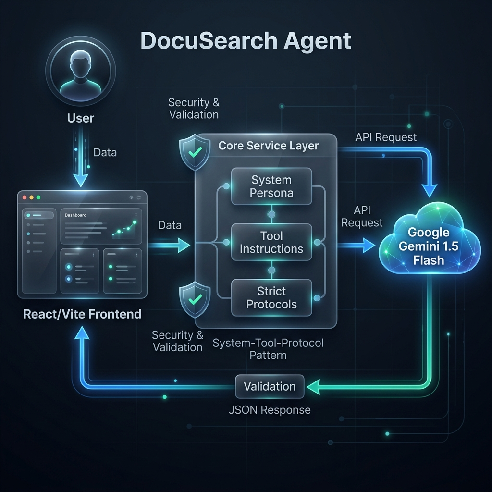

# DocuSearch Agent

> **Enterprise-grade PDF document retrieval agent** powered by Google Gemini 1.5 Flash. Seamlessly search through complex documents using natural language.

[](https://www.typescriptlang.org/)
[](https://react.dev/)
[](https://vitejs.dev/)
[](https://nodejs.org/)
[](LICENSE)

---

## ✨ Features

*   **Multi-Document Support**: Upload and search across up to 10 PDFs (200MB each) simultaneously.
*   **AI-Powered Search**: Natural language queries with fuzzy and semantic matching via Gemini 1.5 Flash.
*   **Page-Level Citations**: Interactive links that jump directly to the relevant page in the viewer.
*   **Advanced PDF Viewer**: Smooth rendering with zooming, rotation, and keyboard navigation.
*   **Modular Architecture**: Clean separation of concerns across `api`, `core`, `components`, and `styles`.
*   **Path Aliasing**: Simplified imports using `@api`, `@core`, `@components`, and `@styles` aliases.
*   **Enterprise Observability**: Structured `LoggerService` for real-time tracking of AI request lifecycles.

---

## 🧱 Architecture

The DocuSearch Agent follows the **System-Tool-Protocol** pattern to ensure predictable and high-quality AI behavior.



*   **System Layer**: Defines the agent's persona and expert role.
*   **Tool Layer**: Operational instructions for document ingestion and retrieval.
*   **Protocol Layer**: Strict constraints on fuzzy matching, error handling, and output formats.

---

## 🛠 Technology Stack

*   **Core**: React 19.2, TypeScript 5.2
*   **AI Engine**: Google Gemini 1.5 Flash API
*   **PDF Core**: PDF.js dist & React-PDF 10.2
*   **Build/Tooling**: Vite 5.2, ESLint, Prettier
*   **Styling**: Tailwind CSS 3.4
*   **Testing**: Vitest 4.0 (with 70%+ coverage)

---

## 🚀 Getting Started

### Prerequisites

*   **Node.js**: v24.14.0 (Recommended, see `.nvmrc`) or v18.0.0+
*   **npm**: v9.0.0 or higher
*   **API Key**: A Google Gemini API key from [Google AI Studio](https://aistudio.google.com/)

### Installation

```bash
# 1. Clone the repository
git clone https://github.com/darshil0/gemini-pdf-retrieval-agent.git
cd gemini-pdf-retrieval-agent

# 2. Install dependencies
npm install

# 3. Configure environment
cp .env.example .env
```

### Configuration

Edit your `.env` file with the following variables:

```env
VITE_GEMINI_API_KEY=your_api_key_here  # Required
VITE_GEMINI_MODEL=gemini-1.5-flash      # Optional (Default: gemini-1.5-flash)
VITE_API_TIMEOUT=60000                  # Optional (Default: 60s)
VITE_MAX_FILE_SIZE=209715200            # Optional (Default: 200MB)
VITE_MAX_FILES=10                       # Optional (Default: 10)
VITE_PDF_WORKER_SRC=                    # Optional (Custom worker URL)
VITE_DEBUG=false                        # Optional (Verbose logging)
```

---

## 💻 Development & Build

| Command | Description |
| :--- | :--- |
| `npm run dev` | Start development server on port 5173 |
| `npm run build` | Build the project for production |
| `npm run preview` | Locally preview the production build |
| `npm test` | Run the full test suite |
| `npm run lint` | Check for linting and type errors |
| `npm run format` | Auto-format codebase with Prettier |

### Maintenance & Production Readiness

We provide automated scripts to ensure your codebase stays optimized and consistent:

*   **Linux/macOS**: `./apply-fixes.sh`
*   **Windows**: `./apply-fixes.ps1`

These scripts perform dependency cleanup, formatting, linting, type-checking, and test validation in a single pass.

### Project Structure & Aliases

The codebase is organized into modular directories with pre-configured path aliases:

| Alias | Directory | Purpose |
| :--- | :--- | :--- |
| `@api` | `src/api/` | External services and API clients |
| `@core` | `src/core/` | Architecture, constants, types, and foundational services |
| `@components` | `src/components/` | Reusable UI components |
| `@styles` | `src/styles/` | Global and component-level stylesheets |
| `@tests` | `src/tests/` | Unit and integration test suites |
| `@` | `src/` | Project root source |

---

## 📂 Documentation

For deep dives into the architecture and API, see the consolidated [DOCUMENTATION.md](docs/DOCUMENTATION.md):

*   [**System Architecture**](docs/DOCUMENTATION.md#1-agent-architecture-documentation)
*   [**API Reference**](docs/DOCUMENTATION.md#2-api-reference)
*   [**Security Protocols**](docs/DOCUMENTATION.md#3-security-policy)
*   [**Deployment Guide**](docs/DOCUMENTATION.md#4-deployment-guide)

---

## 🔧 Troubleshooting

### Memory Constraints
Uploading many large PDFs (8+ files, 50MB+ each) may consume significant browser memory. For best performance on devices with ≤8GB RAM, we recommend limiting concurrent uploads to 5 files.

### PDF Worker Loading
If the PDF viewer fails to load in restricted networks, configure `VITE_PDF_WORKER_SRC` to a local path or a specific CDN mirror. The application includes an automatic fallback mechanism to `unpkg.com`.

### Logging
Enable `VITE_DEBUG=true` to see structured system logs in the browser console, including API request lifecycle and state transitions.

---

## 🤝 Contributing

1.  Fork the Project
2.  Create your Feature Branch (`git checkout -b feature/AmazingFeature`)
3.  Commit your Changes (`git commit -m 'Add some AmazingFeature'`)
4.  Push to the Branch (`git push origin feature/AmazingFeature`)
5.  Open a Pull Request

---

**Built with ❤️ by [Darshil](https://github.com/darshil0)** • [Changelog](CHANGELOG.md)
