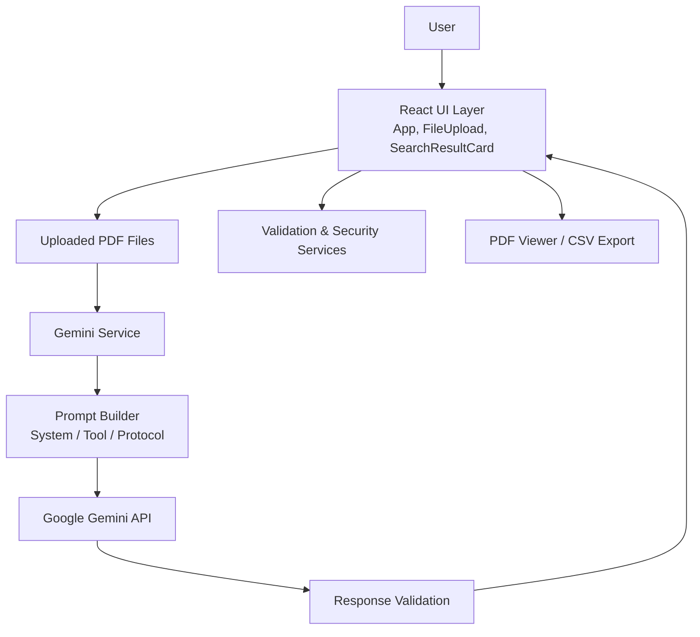

# DocuSearch Agent

DocuSearch Agent is a React, Vite, and TypeScript application for uploading PDF documents, asking natural-language questions against them, and reviewing ranked evidence with page-level context from the Gemini API.

## What the app does

- Upload one or more PDF files (up to 10 by default).
- Run semantic document search with a keyword or natural-language query.
- Review structured results with document index, page number, context snippet, matched term, explanation, and relevance score.
- Filter results by minimum relevance and sort by relevance or page number.
- Open matching pages in an in-app PDF viewer and export matching results to CSV.
- Keep recent searches available for quick reuse.

## Tech stack

- React 19 and Vite 8
- TypeScript with strict mode and path aliases
- Tailwind CSS for styling
- react-pdf and pdfjs-dist for document rendering
- Google Generative AI for semantic search
- Vitest and Testing Library for automated tests
- ESLint and Prettier for code quality and formatting

## Quick start

1. Install prerequisites:
   - Node.js 20+
   - npm 10+
2. Install dependencies:
   ```bash
   npm install
   ```
3. Create an environment file:
   ```bash
   cp .env.example .env
   ```
4. Set a Gemini API key:
   ```env
   VITE_GEMINI_API_KEY=your_gemini_api_key_here
   ```
5. Start the development server:
   ```bash
   npm run dev
   ```

## Environment variables

| Variable | Required | Description |
| :--- | :--- | :--- |
| `VITE_GEMINI_API_KEY` | Yes | Google Gemini API key. |
| `VITE_GEMINI_MODEL` | No | Gemini model name. Defaults to `gemini-1.5-flash`. |
| `VITE_API_TIMEOUT_MS` | No | Request timeout in milliseconds. Defaults to `60000`. |
| `VITE_MAX_FILE_SIZE` | No | Maximum upload size in bytes. Defaults to `209715200`. |
| `VITE_MAX_FILES` | No | Maximum number of uploaded files. Defaults to `10`. |
| `VITE_PDF_WORKER_SRC` | No | Optional custom PDF.js worker URL. |
| `VITE_DEBUG` | No | Enables verbose logging when set to `true`. |
| `VITE_PORT` | No | Local dev server port. Defaults to `5173`. |

## Project structure

- [src/App.tsx](src/App.tsx) contains the main UI, search workflow, viewer state, result filtering, and CSV export.
- [src/components](src/components) contains the upload and result-card components.
- [src/api/gemini.ts](src/api/gemini.ts) wraps the Gemini integration, prompt generation, timeout handling, and response validation.
- [src/core](src/core) contains shared types, prompts, validation, security, and logging utilities.
- [src/tests](src/tests) contains the automated test suite.

## Scripts

| Command | Purpose |
| :--- | :--- |
| `npm run dev` | Start the local Vite development server. |
| `npm run build` | Build the production bundle. |
| `npm test` | Run the Vitest suite. |
| `npm run lint` | Run ESLint with zero warnings enforced. |
| `npm run type-check` | Run TypeScript without emitting files. |
| `npm run format` | Format the source files with Prettier. |

## Architecture overview

The application uses a simple three-part structure:

1. UI layer: React components orchestrate the upload, search, result review, and viewer experience.
2. Service layer: Gemini, validation, security, and logging services isolate external API calls and safety checks.
3. Prompt layer: structured prompt definitions guide the Gemini response format and constraints.



## Documentation map

- [docs/DOCUMENTATION.md](docs/DOCUMENTATION.md) for the implementation reference.
- [docs/agent_architecture/SYSTEM_PROMPT.md](docs/agent_architecture/SYSTEM_PROMPT.md) for the agent persona.
- [docs/agent_architecture/TOOL_PROMPTS.md](docs/agent_architecture/TOOL_PROMPTS.md) for the search instructions.
- [docs/agent_architecture/PROTOCOLS.md](docs/agent_architecture/PROTOCOLS.md) for the matching and response rules.
- [docs/remaining-issues.md](docs/remaining-issues.md) for the current backlog.

## Status

Version: 1.4.4
Last reviewed: 2026-07-07
Status: production-ready for local development and static deployment.
Verified checks: `npm test`, `npm run build`, and `npm run lint`.

## Release highlights

- Integrated SecurityService for deep PDF magic bytes validation and search rate limiting.
- Enhanced PDF viewer with zoom controls (In/Out/Reset).
- Added ability to clear recent search history.
- Refreshed the docs and architecture notes to match the current implementation.
