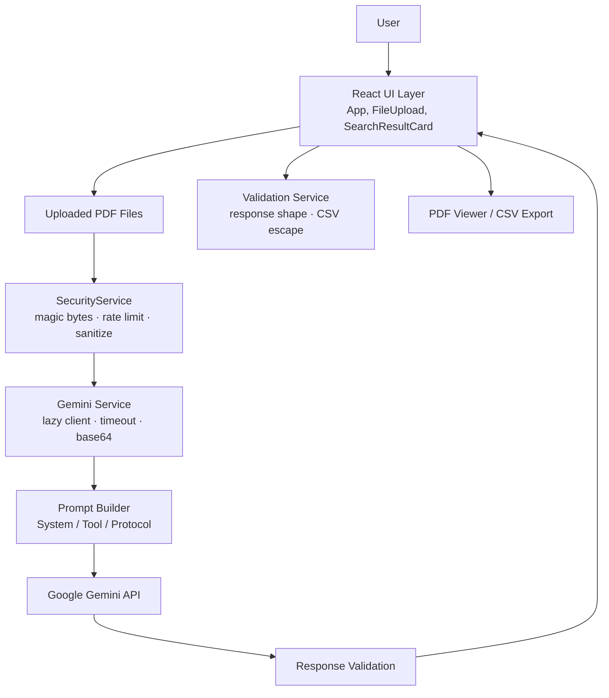

# DocuSearch Agent

DocuSearch Agent is a React, Vite, and TypeScript application for uploading PDF documents, asking natural-language questions against them, and reviewing ranked evidence with page-level context from the Gemini API.

## What the app does

- Upload one or more PDF files (up to 10 by default).
- Run semantic document search with a keyword or natural-language query.
- Review structured results with document index, page number, context snippet, matched term, explanation, and relevance score.
- Filter results by minimum relevance and sort by relevance or page number.
- Open matching pages in an in-app PDF viewer and export matching results to CSV.
- Keep recent searches available for quick reuse.
- Displays an API key configuration notice when `VITE_GEMINI_API_KEY` is missing so the app never crashes silently.

## Tech stack

- React 19 and Vite 8
- TypeScript with strict mode and path aliases
- Tailwind CSS for styling
- react-pdf and pdfjs-dist for document rendering
- Google Generative AI for semantic search
- Vitest and Testing Library for automated tests
- ESLint and Prettier for code quality and formatting

## Quick start

1. Install prerequisites:
   - Node.js 20+
   - npm 10+
2. Install dependencies:
   ```bash
   npm install
   ```
3. Create an environment file:
   ```bash
   cp .env.example .env
   ```
4. Set a Gemini API key:
   ```env
   VITE_GEMINI_API_KEY=your_gemini_api_key_here
   ```
5. Start the development server:
   ```bash
   npm run dev
   ```

## Environment variables

| Variable              | Required | Description                                            |
| :-------------------- | :------- | :----------------------------------------------------- |
| `VITE_GEMINI_API_KEY` | Yes      | Google Gemini API key.                                 |
| `VITE_GEMINI_MODEL`   | No       | Gemini model name. Defaults to `gemini-1.5-flash`.     |
| `VITE_API_TIMEOUT_MS` | No       | Request timeout in milliseconds. Defaults to `60000`.  |
| `VITE_MAX_FILE_SIZE`  | No       | Maximum upload size in bytes. Defaults to `209715200`. |
| `VITE_MAX_FILES`      | No       | Maximum number of uploaded files. Defaults to `10`.    |
| `VITE_PDF_WORKER_SRC` | No       | Optional custom PDF.js worker URL.                     |
| `VITE_DEBUG`          | No       | Enables verbose logging when set to `true`.            |
| `VITE_PORT`           | No       | Local dev server port. Defaults to `5173`.             |

## Project structure

- [src/App.tsx](src/App.tsx) — main UI, search workflow, viewer state, result filtering, and CSV export.
- [src/components/](src/components) — `FileUpload` and `SearchResultCard` presentational components.
- [src/api/gemini.ts](src/api/gemini.ts) — Gemini client with lazy initialization, prompt construction, timeout handling, and response validation.
- [src/core/architecture/prompts.ts](src/core/architecture/prompts.ts) — structured agent prompt constants (persona, tool instructions, protocol).
- [src/core/types/index.ts](src/core/types/index.ts) — shared domain types (`SearchResult`, `SearchResponse`, `UploadedFile`, `AppStatus`).
- [src/core/services/securityService.ts](src/core/services/securityService.ts) — file magic-byte validation, input sanitization, query validation, and rate limiting.
- [src/core/services/validation.ts](src/core/services/validation.ts) — runtime shape validation for API responses and helper utilities.
- [src/core/services/logger.ts](src/core/services/logger.ts) — structured leveled logging with context labels and environment-aware minimum level.
- [src/core/constants/errors.ts](src/core/constants/errors.ts) — centralized user-facing error message constants.
- [src/tests/](src/tests) — automated test suite (unit, integration, security, architecture).

## Scripts

| Command                 | Purpose                                              |
| :---------------------- | :--------------------------------------------------- |
| `npm run dev`           | Start the local Vite development server.             |
| `npm run build`         | Build the production bundle.                         |
| `npm test`              | Run the Vitest test suite.                           |
| `npm run test:coverage` | Run tests and generate a v8 coverage report.         |
| `npm run lint`          | Run ESLint with zero warnings enforced.              |
| `npm run type-check`    | Run TypeScript type checking without emitting files. |
| `npm run format`        | Format source files with Prettier.                   |
| `npm run format:check`  | Check that all files match Prettier's code style.    |

## Architecture overview

The application uses a three-layer structure:

1. **UI layer** — React components orchestrate upload, search, result review, and viewer experience.
2. **Service layer** — Gemini, validation, security, and logging services isolate external API calls and safety checks.
3. **Prompt layer** — structured prompt definitions guide the Gemini response format and constraints.


```mermaid
flowchart TD
    U[User] --> UI[React UI Layer<br/>App, FileUpload, SearchResultCard]
    UI --> Files[Uploaded PDF Files]
    Files --> Sec[SecurityService<br/>magic bytes · rate limit · sanitize]
    Sec --> G[Gemini Service<br/>lazy client · timeout · base64]
    UI --> V[Validation Service<br/>response shape · CSV escape]
    G --> P[Prompt Builder<br/>System / Tool / Protocol]
    P --> A[Google Gemini API]
    A --> R[Response Validation]
    R --> UI
    UI --> PDF[PDF Viewer / CSV Export]
```

## Documentation map

- [docs/DOCUMENTATION.md](docs/DOCUMENTATION.md) — implementation reference.
- [docs/agent_architecture/SYSTEM_PROMPT.md](docs/agent_architecture/SYSTEM_PROMPT.md) — agent persona.
- [docs/agent_architecture/TOOL_PROMPTS.md](docs/agent_architecture/TOOL_PROMPTS.md) — search instructions.
- [docs/agent_architecture/PROTOCOLS.md](docs/agent_architecture/PROTOCOLS.md) — matching and response rules.
- [docs/remaining-issues.md](docs/remaining-issues.md) — current backlog.

## Status

Version: 1.4.4  
Last reviewed: 2026-09-02  
Status: production-ready for local development and static deployment.  
Verified checks: `npm test` (56 tests, 8 suites), `npm run test:coverage` (statements 86 %, branches 68 %, functions 86 %, lines 87 %), `npm run build`, `npm run lint`, `npm run type-check`, `npm audit` (0 vulnerabilities).

## Release highlights — v1.4.4

- **Lazy API key initialization** — the app no longer throws a white-screen error on startup when the API key is absent; an amber notice banner is shown instead.
- **API key missing / invalid banner** — the UI surfaces a clear actionable message when `VITE_GEMINI_API_KEY` is unconfigured or malformed.
- **Empty file security bypass fixed** — zero-byte files now correctly fail magic-byte validation instead of being accepted.
- **SQL injection false positives eliminated** — replaced the overly broad query-rejection regex with structured pattern matching so ordinary search terms such as "update status" or "report from Q3" are accepted.
- **Multi-document page sorting fixed** — results sort by document index first, then page number, when the sort mode is set to `page`.
- **Stale results cleared on file removal** — removing an uploaded file now also resets `data` and `status` so orphaned result cards are not displayed.
- **Duplicate CSS rule removed** — the duplicate `body` definition in `index.css` has been cleaned up.
- **Security dependencies hardened** — `js-yaml` upgraded to 5.4.1; `minimatch` ReDoS vulnerability in `@typescript-eslint/typescript-estree` resolved via a scoped override; `npm audit` now reports **0 vulnerabilities**.
- **Test coverage significantly expanded** — added security integration tests (rate limiting, SQL injection blocking, XSS sanitization, magic-byte rejection), viewer modal controls, theme switching, drag-and-drop, duplicate file rejection, and logger coverage tests.
- **`public/vite.svg` favicon added** — eliminated the 404 error for the default Vite favicon referenced in `index.html`.
