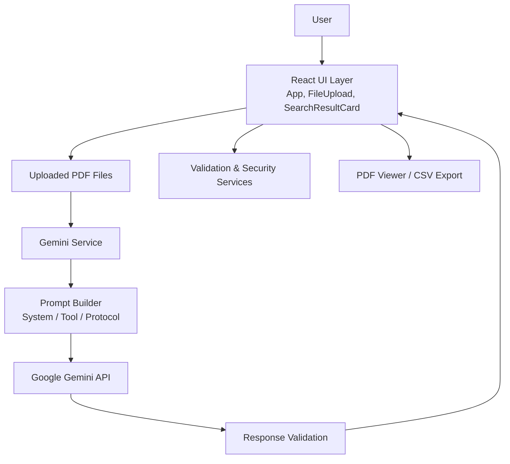

# DocuSearch Agent Documentation

This document is the implementation-oriented companion to [README.md](../README.md). It explains how the current application is structured, how the major modules behave, and how to work with the codebase safely.

## 1. Application overview

DocuSearch Agent is a browser-based document retrieval experience. A user uploads PDF files, submits a search term, and the application sends the files and prompt to the Gemini API. The response is validated and rendered as ranked search results with page references and context snippets.

### Primary user flow

1. Upload PDF files through the file picker or drag-and-drop region.
2. Enter a keyword or phrase in the search form.
3. Trigger a search.
4. Review the ranked results, filter them by relevance, and sort them by relevance or page number.
5. Open the matching PDF page in the built-in viewer and export relevant matches to CSV when needed.

## 2. Core modules

### UI layer

- [src/App.tsx](../src/App.tsx) owns state for files, search terms, recent searches, viewer state, filtering, sorting, and result export.
- [src/components/FileUpload.tsx](../src/components/FileUpload.tsx) handles file validation, upload limits, and file removal.
- [src/components/SearchResultCard.tsx](../src/components/SearchResultCard.tsx) renders individual search hits with highlighting and view actions.

### Service layer

- [src/api/gemini.ts](../src/api/gemini.ts) wraps the Gemini API integration, prompt generation, timeout handling, and response validation.
- [src/core/services/validation.ts](../src/core/services/validation.ts) validates API payloads, CSV values, and local storage arrays.
- [src/core/services/securityService.ts](../src/core/services/securityService.ts) handles file type checks, size validation, query checks, and rate limiting.
- [src/core/services/logger.ts](../src/core/services/logger.ts) provides structured logging helpers.

### Prompt architecture

- [src/core/architecture/prompts.ts](../src/core/architecture/prompts.ts) defines the system persona, tool instructions, and protocol constraints used for the Gemini request.

### Architecture diagram



## 3. Data contracts

### SearchResult

```ts
interface SearchResult {
  docIndex: number;
  pageNumber: number;
  contextSnippet: string;
  relevanceExplanation: string;
  relevanceScore: number;
  matchedTerm: string;
}
```

### SearchResponse

```ts
interface SearchResponse {
  results: SearchResult[];
  summary: string;
}
```

### UploadedFile

```ts
interface UploadedFile {
  file: File;
  id: string;
  previewUrl: string;
}
```

## 4. Runtime behavior

### File handling

The upload component enforces the following rules:

- Only PDF files are accepted.
- Files larger than the configured limit are rejected.
- Duplicate uploads are rejected by name and size.
- The maximum upload count is controlled by `VITE_MAX_FILES`.

### Search handling

The application sends the uploaded files and the user query to the Gemini service. The model is instructed to return a JSON object with a summary and a results array. The response is validated before it is rendered.

### Result controls

After search results are loaded, the UI exposes:

- a minimum relevance slider for filtering out weaker matches,
- a sort selector for ordering by relevance or page number, and
- an export action for sending the filtered results to CSV.

### Viewer behavior

When a result is opened, the app loads the source PDF and displays the target page in a modal viewer. The viewer supports page navigation, rotation, and download of the original file.

## 5. Security and reliability

The application includes the following safeguards:

- Input sanitization for basic HTML escaping.
- File type and file size validation before upload is processed.
- Query validation to reject suspicious patterns.
- Persistent client-side rate limiting for repeated interactions.
- Structured logging for operational diagnostics.

## 6. Configuration

The app is configured through environment variables defined in [.env.example](../.env.example). The most important values are:

- `VITE_GEMINI_API_KEY`
- `VITE_GEMINI_MODEL`
- `VITE_API_TIMEOUT_MS`
- `VITE_MAX_FILE_SIZE`
- `VITE_MAX_FILES`
- `VITE_PDF_WORKER_SRC`
- `VITE_DEBUG`

## 7. Development workflow

Use the standard scripts from the repository root:

> Current release: 1.4.3

```bash
npm install
npm run dev
npm test
npm run lint
npm run build
```

## 8. Testing notes

The test suite covers:

- UI rendering and interaction
- File upload validation
- Search result rendering
- Security utilities
- Validation service behavior
- Integration flow from upload to result display

## 9. Documentation links

- [README.md](../README.md)
- [docs/agent_architecture/SYSTEM_PROMPT.md](agent_architecture/SYSTEM_PROMPT.md)
- [docs/agent_architecture/TOOL_PROMPTS.md](agent_architecture/TOOL_PROMPTS.md)
- [docs/agent_architecture/PROTOCOLS.md](agent_architecture/PROTOCOLS.md)
- [docs/remaining-issues.md](remaining-issues.md)
