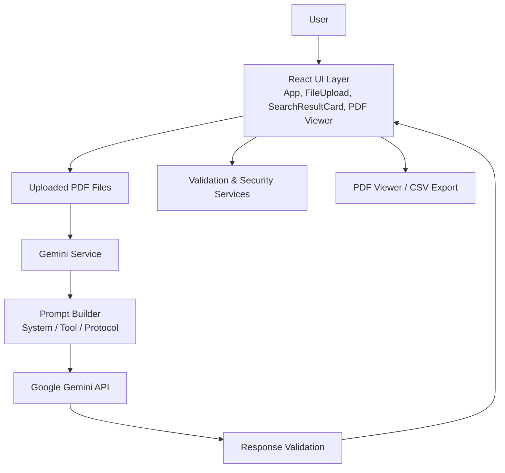

# DocuSearch Agent Documentation

This document is the implementation-oriented companion to [README.md](../README.md). It explains how the current application is structured, how the major modules behave, and how to work with the codebase safely.

## 1. Application overview

DocuSearch Agent is a browser-based document retrieval experience. A user uploads PDF files, submits a search term, and the application sends the files and prompt to the Gemini API. The response is validated and rendered as ranked search results with page references and context snippets.

### Primary user flow

1. Upload PDF files through the file picker or drag-and-drop region.
2. Enter a keyword or phrase in the search form.
3. Trigger a search.
4. Review the ranked results, filter them by relevance, and sort them by relevance or page number.
5. Open the matching PDF page in the built-in viewer and export relevant matches to CSV when needed.

## 2. Core modules

### UI layer

- [src/App.tsx](../src/App.tsx) owns state for files, search terms, recent searches, filtering, sorting, and result export.
- [src/components/FileUpload.tsx](../src/components/FileUpload.tsx) handles file validation, upload limits, and file removal.
- [src/components/SearchResultCard.tsx](../src/components/SearchResultCard.tsx) renders individual search hits with highlighting and view actions.
- The in-app PDF viewer is embedded directly in `App.tsx` and provides zoom, rotation, page navigation, and download within a modal.

### Service layer

- [src/api/gemini.ts](../src/api/gemini.ts) wraps the Gemini API integration, prompt generation, timeout handling, and response validation.
- [src/core/services/validation.ts](../src/core/services/validation.ts) validates API payloads, CSV values, and local storage arrays.
- [src/core/services/securityService.ts](../src/core/services/securityService.ts) handles file type checks, size validation, query checks, and rate limiting.
- [src/core/services/logger.ts](../src/core/services/logger.ts) provides structured logging helpers.

### Prompt architecture

- [src/core/architecture/prompts.ts](../src/core/architecture/prompts.ts) defines the system persona, tool instructions, and protocol constraints used for the Gemini request.

### Architecture diagram


```mermaid
flowchart TD
    U[User] --> UI[React UI Layer<br/>App, FileUpload, SearchResultCard, PDF Viewer]
    UI --> Files[Uploaded PDF Files]
    Files --> G[Gemini Service]
    UI --> V[Validation & Security Services]
    G --> P[Prompt Builder<br/>System / Tool / Protocol]
    P --> A[Google Gemini API]
    A --> R[Response Validation]
    R --> UI
    UI --> PDF[PDF Viewer / CSV Export]
```

## 3. Data contracts

### SearchResult

```ts
interface SearchResult {
  docIndex: number;
  pageNumber: number;
  contextSnippet: string;
  relevanceExplanation: string;
  relevanceScore: number;
  matchedTerm: string;
}
```

### SearchResponse

```ts
interface SearchResponse {
  results: SearchResult[];
  summary: string;
}
```

### UploadedFile

```ts
interface UploadedFile {
  file: File;
  id: string;
  previewUrl: string;
}
```

## 4. Runtime behavior

### File handling

The upload component enforces the following rules:

- Only PDF files are accepted.
- Files larger than the configured limit are rejected.
- Duplicate uploads are rejected by name and size.
- The maximum upload count is controlled by `VITE_MAX_FILES`.

### Search handling

The application sends the uploaded files and the user query to the Gemini service. The model is instructed to return a JSON object with a summary and a results array. The response is validated before it is rendered.

### Result controls

After search results are loaded, the UI exposes:

- a minimum relevance slider for filtering out weaker matches,
- a sort selector for ordering by relevance or page number, and
- an export action for sending the filtered results to CSV.

### Viewer behavior

When a result is opened, the app loads the source PDF and displays the target page in a modal viewer. The viewer supports page navigation, zoom, rotation, and download of the original file. The PDF.js worker defaults to the local bundled worker but can be overridden via `VITE_PDF_WORKER_SRC`.

## 5. Security and reliability

The application includes the following safeguards and security design considerations:

- **Input Sanitization & Boundary Handling**: Trims search query whitespace and strips non-printable control characters without entity-mangling operators (such as `<` or `>`), preserving raw search keywords.
- **CSV Formula Injection Prevention**: Neutralizes spreadsheet formula injection in CSV export (`escapeCSVField`) by prefixing formula characters (`=`, `+`, `-`, `@`, `\t`, `\r`) with a single quote (`'`).
- **File Type & Magic Byte Validation**: Validates file magic bytes (`%PDF` header) before processing, preventing non-PDF files or zero-byte empty files from being uploaded.
- **File Size Validation**: Enforces maximum upload file size (`VITE_MAX_FILE_SIZE`, defaulting to 200MB per file).
- **Prompt Injection Defense**: Encapsulates search keywords in explicit instruction boundaries (`<<<TARGET SEARCH KEYWORD START>>>`) with instructions instructing the model to treat the query strictly as string data.
- **Client-Side Rate Limiting**: Tracks search frequency in `localStorage` to prevent accidental rapid search submissions (default 10 searches per minute).
- **Gated Test API Key Format Bypass**: Format validation bypasses for synthetic test keys (`AIzaTestKey`) are disabled in production builds (`!import.meta.env.PROD`).
- **Production Sourcemap Disabling**: Production builds disable sourcemap generation (`sourcemap: mode === 'development'`) in `vite.config.ts`.
- **Structured Logging**: Contextual structured logging (`createLogger`) for operational diagnostics.

## 6. Configuration

The app is configured through environment variables defined in [.env.example](../.env.example). The most important values are:

- `VITE_GEMINI_API_KEY`
- `VITE_GEMINI_MODEL`
- `VITE_API_TIMEOUT_MS`
- `VITE_MAX_FILE_SIZE`
- `VITE_MAX_FILES`
- `VITE_RATE_LIMIT`
- `VITE_PDF_WORKER_SRC`
- `VITE_DEBUG`

## 7. Development workflow

Use the standard scripts from the repository root:

> Current release: 1.4.4

```bash
npm install
npm run dev
npm test
npm run lint
npm run build
```

## 8. Testing notes

The test suite covers:

- UI rendering and interaction (App component, theme toggling, file selection)
- File upload validation (type checking, size limits, duplicate detection, drag-and-drop, file count limits)
- Search result rendering (highlighting, view actions, empty results)
- Security utilities (rate limiting, SQL injection detection, XSS sanitization, magic-byte validation)
- Validation service behavior (response shape validation, CSV escaping, string array validation)
- Integration flow from upload to result display
- PDF viewer modal controls (zoom, rotation, page navigation, close via button/Escape)
- Agent architecture prompt construction (persona, tool instructions, protocol constraints)

Run the full suite with:

```bash
npm test
```

For coverage reporting:

```bash
npm run test:coverage
```

## 9. Troubleshooting

| Symptom | Likely cause | Fix |
| :--- | :--- | :--- |
| Amber "API key not configured" banner | `VITE_GEMINI_API_KEY` is missing or malformed | Set a valid key in `.env` and restart the dev server |
| Search returns no results | Relevance threshold too high or query too narrow | Lower the minimum relevance slider or broaden the search term |
| "Rate limit exceeded" error | More than 10 searches per minute | Wait a moment or increase `VITE_RATE_LIMIT` |
| PDF viewer fails to render | PDF.js worker not loading | Set `VITE_PDF_WORKER_SRC` to a custom CDN URL |
| File upload rejected | Non-PDF file or corrupted PDF | Only valid PDF files with correct magic bytes are accepted |

## 10. Documentation links

- [README.md](../README.md)
- [docs/agent_architecture/SYSTEM_PROMPT.md](agent_architecture/SYSTEM_PROMPT.md)
- [docs/agent_architecture/TOOL_PROMPTS.md](agent_architecture/TOOL_PROMPTS.md)
- [docs/agent_architecture/PROTOCOLS.md](agent_architecture/PROTOCOLS.md)
- [docs/remaining-issues.md](remaining-issues.md)
